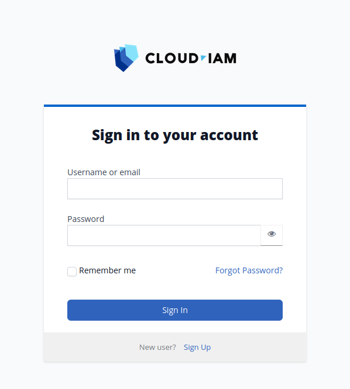

# Cloud-IAM Example Keycloak theme

Customisation example of the login page



- Targets **Keycloak 26.6.x**. 
- Requires Node.js 20+ and JDK 21.

## ⚠️ Demo only

This repository is a **demonstration** of how to put a custom Keycloak theme together: packaging structure, build pipeline, FTL/SCSS layout, and the Maven wrapper around it.
It's published as a starting point for teams who want to ship their own theme.

Please don't deploy this theme as-is in production.
It isn't actively maintained, the styling is illustrative rather than polished, and the asset pipeline is tuned for clarity over robustness.
Fork it, adapt it to your brand, give it a once-over, and make it yours. 
See the *"How to use this theme as a starter"* section below.

## Install dependencies

```
npm install
```

## Compile theme scss files

```
npm run build
```

## Build the theme extension

```
mvn package
```

## Theme Development Workflow

Build this theme `.jar` file with:

```bash
# build the theme and wrap it in a .jar file
npm install && npm run build && mvn package
```

Then start Keycloak IAM (in single-node mode) locally through docker. The host `./src/main/resources/theme` folder is mounted into the Keycloak container as its themes directory, and the theme/template caches are disabled — so changes to `.ftl` files and `theme.properties` are picked up on the next page load. Only SCSS changes need a rebuild (`npm run build`) to regenerate `dist/login.css`. Use `./watch.sh` (requires `npm i -g nodemon`) to auto-rebuild SCSS on save.

```bash
docker compose up -d
```

Connect to Keycloak console [http://localhost:8080](http://localhost:8080), click on `Themes` tab, and select `cloud-iam-redesign` in front of `Login Theme`.

## More :

If you want to activate the login, email or other theme, open :
```bash
src/main/resources/META-INF/keycloak-themes.json
```
change the type to put the themes you want :
```bash
{
    "themes": [{
        "name" : "cloud-iam-redesign",
        "types": [ "login", "email" ]
    }]
}
```

## How to use this theme as a starter

If you want to start developing your new theme based on our existing template, help yourself!

Assuming your company is named `acme`, you'll have to setup a few things before building your own theme.

- rename `src/main/resources/theme/cloud-iam-redesign` to `src/main/resources/theme/acme`
- in `package.json`: 
  - adjust the name
  - adjust the description
  - adjust the `scripts.build` section accordingly with the new path `src/main/resources/theme/acme` in the parcel commands
- in `pom.xml`:
  - set your own group id
  - set your own artifact id

- in `src/main/resources/META-INF/keycloak-themes.json`, adjust the theme name to `acme`

## Resources

- https://www.baeldung.com/spring-keycloak-custom-themes
- see also https://www.keycloakify.dev/ (https://github.com/InseeFrLab/keycloakify)
